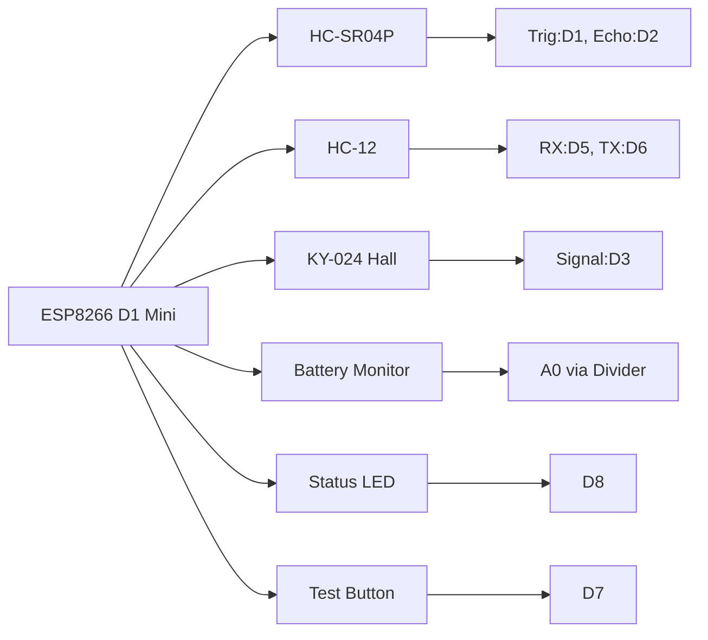
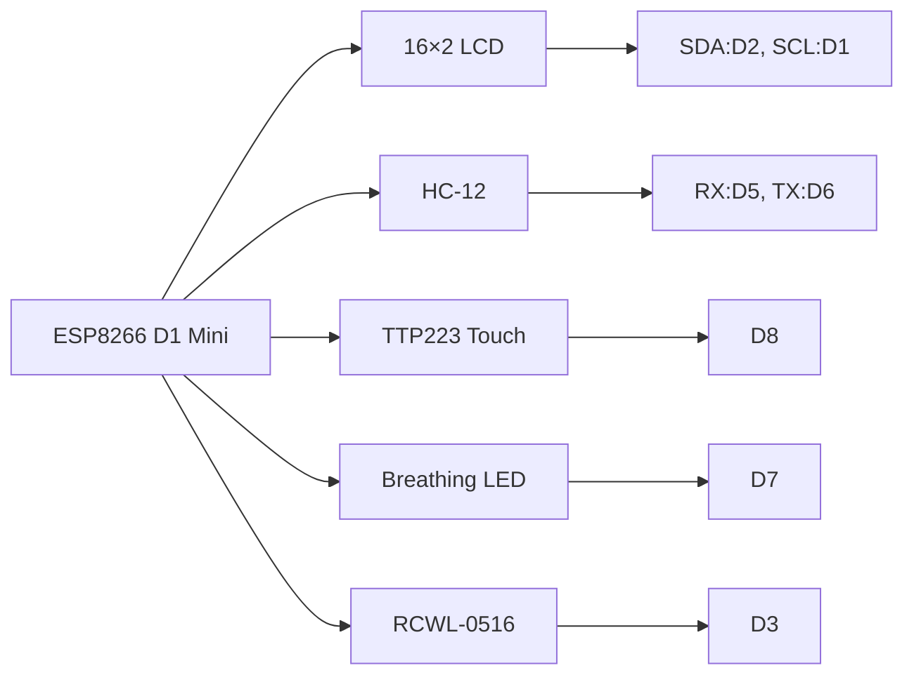

# 📮 Low-Power Mailbox Notifier System

[](https://opensource.org/licenses/MIT)
[](https://www.espressif.com/en/products/socs/esp8266)
[](https://www.electrodragon.com/product/hc-12-433mhz-serial-wireless-module/)
[](https://www.home-assistant.io/)
[](https://www.ti.com/product/TPS63070)

A robust, long-range mailbox notification system using ESP8266 microcontrollers and HC-12 433MHz radio modules. Designed for maximum battery life with intelligent power management and seamless Home Assistant integration.

---

## ✨ Key Features

### 📬 **Transmitter (Battery-Powered)**
- 🔋 **Ultra-Low Power**: Multi-month battery life using deep sleep optimization
- 📏 **Mail Detection**: HC-SR04P ultrasonic sensor for precise distance measurement
- 🏠 **Hall Sensor Support**: Optional mailbox door detection (KY-024)
- 🔄 **Reliable Delivery**: ACK confirmation with retry logic (up to 5 attempts)
- ⚡ **Battery Monitoring**: Real-time voltage monitoring with low-voltage cutoff
- 🔋 **Flexible Power**: Supports 18650 Li-ion or 2x AA NiMH configurations

### 🏠 **Receiver (Always-On Gateway)**
- ⏰ **Time Synchronization**: NTP sync with automatic DST handling
- 📱 **Visual Display**: 16×2 I2C LCD showing status and timestamps
- 💡 **Smart LED**: Breathing effect for new notifications
- 📊 **Home Assistant**: Native ESPHome integration with MQTT support
- 🏃 **Presence Detection**: Optional RCWL-0516 for automatic light control
- 🔄 **Manual Control**: Touch button for notification management

---

## 🎯 **Choose Your Integration Option**

This project offers **two firmware approaches** to suit different needs:

| Option | Description | Best For |
|--------|-------------|----------|
| **🔧 Standalone Arduino** | Traditional Arduino IDE programming with direct HC-12 communication | Users who prefer direct control without Home Assistant dependencies |
| **🏠 ESPHome Integration** | Native Home Assistant sensors with YAML configuration | Smart home enthusiasts wanting automation and dashboard integration |

### 📋 **Feature Comparison**

| Feature | Standalone Arduino | ESPHome Integration |
|---------|-------------------|-------------------|
| **Programming** | Arduino IDE (.ino files) | ESPHome YAML configuration |
| **Home Assistant** | Not integrated | Native sensors and entities |
| **LCD Display** | ✅ Supported | ✅ Supported |
| **MQTT Publishing** | ✅ Optional | ✅ Built-in |
| **OTA Updates** | ❌ Manual only | ✅ Automatic |
| **Configuration** | Code modification | YAML files and web interface |
| **Learning Curve** | Medium (Arduino) | Easy (YAML) |
| **Dependency** | Arduino IDE | ESPHome + Home Assistant |

### 📦 **Required Components**

| Category | Component | Qty | Notes |
|----------|-----------|-----|-------|
| **Microcontrollers** | WeMos D1 Mini (ESP8266) | 2 | Main control units |
| **Radio Communication** | HC-12 433MHz Modules | 2 | Long-range wireless link |
| **Sensing** | HC-SR04P Ultrasonic Sensor | 1 | Mail detection |
| **Sensing (Optional)** | KY-024 Hall Effect Sensor | 1 | Door detection |
| **Display** | 16×2 I2C LCD (0x27/0x3F) | 1 | Status and time display |
| **Power (Transmitter)** | 18650 Li-ion or 2× AA NiMH | 1/2 | Battery supply |
| **Power (Receiver)** | 5V USB Power Adapter | 1 | Permanent gateway power |

### ⚡ **Power Management Components**

| Battery Type | DC-DC Converter | Voltage Divider | Efficiency |
|--------------|-----------------|-----------------|------------|
| **18650 Li-ion** | TPS63070 (7µA IQ) | 390kΩ + 100kΩ | 95%+ |
| **2× AA NiMH** | TPS63020 (50µA IQ) | 220kΩ + 100kΩ | 90%+ |

---

## 🛠️ **Hardware Setup**

### 📬 **Transmitter Wiring**



| Component | ESP8266 Pin | GPIO | Function |
|-----------|-------------|------|----------|
| HC-12 RX | D5 | GPIO14 | Serial RX |
| HC-12 TX | D6 | GPIO12 | Serial TX |
| HC-SR04P Trig | D1 | GPIO5 | Ultrasonic trigger |
| HC-SR04P Echo | D2 | GPIO4 | Ultrasonic echo |
| Hall Sensor | D3 | GPIO0 | Door detection |
| Status LED | D8 | GPIO15 | Activity indicator |
| Test Button | D7 | GPIO13 | Manual trigger |
| Battery Monitor | A0 | ADC | Voltage sensing |

### 🏠 **Receiver Wiring**



| Component | ESP8266 Pin | GPIO | Function |
|-----------|-------------|------|----------|
| LCD SDA | D2 | GPIO4 | I2C data |
| LCD SCL | D1 | GPIO5 | I2C clock |
| HC-12 RX | D5 | GPIO14 | Serial RX |
| HC-12 TX | D6 | GPIO12 | Serial TX |
| Touch Button | D8 | GPIO15 | Reset control |
| Breathing LED | D7 | GPIO13 | PWM indicator |
| Presence Sensor | D3 | GPIO0 | Motion detection |

---

## 💻 **Software Configuration**

### 📋 **Firmware Options**

Choose one of the two firmware approaches based on your needs:

#### 🔧 **Option 1: Standalone Arduino (No Home Assistant)**
**For users who prefer traditional Arduino programming without smart home integration.**

**Files needed:**
- `Low-Power-Mailbox-Notifier_Transmitter.ino` (transmitter)
- `Low-Power-Mailbox-Notifier_Receiver_Gateway.ino` (receiver)

**Setup Steps:**
1. Install Arduino IDE with ESP8266 board support
2. Open the .ino files in Arduino IDE
3. Configure battery type and WiFi credentials in receiver code
4. Upload to respective ESP8266 modules

**Features:**
- Direct LCD display control
- Serial monitor debugging
- Manual configuration via code
- No external dependencies

#### 🏠 **Option 2: ESPHome Integration (Home Assistant)**
**For users wanting smart home automation and dashboard integration.**

### 1️⃣ **ESPHome Setup**

**Prerequisites:**
- ESPHome installed: `pip install esphome`
- Home Assistant with ESPHome integration

**Installation Steps:**
1. Copy `mailbox_receiver.yaml` to your ESPHome configuration directory
2. Update secrets in your `secrets.yaml`:
   ```yaml
   wifi_ssid: "Your_WiFi_SSID"
   wifi_password: "Your_WiFi_Password"
   mqtt_broker: "192.168.1.100"
   mqtt_username: "mqtt_user"
   mqtt_password: "mqtt_password"
   ```

3. Compile and flash:
   ```bash
   esphome run mailbox_receiver.yaml
   ```

### 2️⃣ **Transmitter Configuration**

**Battery Type Selection** (in `Transmitter.ino`):
```cpp
// Choose ONE:
#define BATTERY_TYPE_18650  // For 3.0V-4.2V Li-ion
// #define BATTERY_TYPE_NIMH // For 2.0V-2.8V NiMH
```

**DC-DC Converter Setup:**
- **TPS63070**: Connect PS pin to GND, EN pin to V_BAT
- **TPS63020**: Same configuration for NiMH operation

**Voltage Divider Wiring:**
```
Battery (+) → 390kΩ (Li-ion) or 220kΩ (NiMH) → ESP8266 A0
                                 ↓
                             100kΩ → GND
```

---

## 🏡 **ESPHome Integration Features** *(ESPHome Option Only)*

*This section applies only to the ESPHome integration option. Standalone Arduino users can skip this section.*

### 📊 **Available Home Assistant Sensors**

| Sensor | Entity ID | Description |
|--------|-----------|-------------|
| **Status** | `sensor.mailbox_status` | Current mailbox state |
| **Battery** | `sensor.mailbox_battery_level` | Transmitter battery % |
| **Time** | `sensor.mailbox_last_reception_time` | Last reception timestamp |
| **WiFi** | `sensor.mailbox_receiver_wifi_signal` | Gateway signal strength |
| **Presence** | `binary_sensor.mailbox_presence_detected` | Motion detection |

### 🎛️ **Available Controls**

| Control | Entity ID | Function |
|---------|-----------|----------|
| **Reset Button** | `button.mailbox_reset_notification` | Clear notification |
| **LED Control** | `switch.mailbox_indicator_led` | Manual LED control |
| **LCD Backlight** | `switch.mailbox_lcd_backlight` | Display backlight |

### 📱 **MQTT Topics** (Alternative Integration)

```yaml
# Subscribe to these topics in Home Assistant
home/mailbox/message     # Status messages
home/mailbox/battery     # Battery percentage
home/mailbox/reception_time  # Timestamp
```

---

## 🔋 **Power Optimization Details**

### 🎯 **Deep Sleep Strategy**
- **Wake Interval**: 1 second (timer-based)
- **Deep Sleep Duration**: 1 second (continuous cycle)
- **Active Time**: <50ms per wake cycle
- **Average Current**: <10µA during sleep

### ⚡ **Power Consumption Breakdown**

| Component | Sleep Current | Active Current | Duty Cycle |
|-----------|---------------|----------------|------------|
| ESP8266 | 5µA | 80mA | 0.005% |
| HC-12 | 3µA | 100mA | 0.1% |
| TPS63070 | 7µA | 40mA | 100% |
| Sensors | 0µA | 20mA | 0.01% |
| **Total** | **15µA** | **~100mA** | **<1%** |

### 🔋 **Battery Life Estimation**

| Battery Type | Capacity | Daily Consumption | Expected Life |
|--------------|----------|------------------|---------------|
| **18650** | 2500mAh | 0.36mAh | **~2.5 years** |
| **2× AA NiMH** | 2000mAh | 0.36mAh | **~2 years** |

---

## 📡 **Communication Protocol**

### 🔄 **Message Format**

```cpp
typedef struct {
    char message[20];      // Status message
    int battery_percent;   // Battery level (0-100)
} MailboxData;
```

### 📋 **Message Types**

| Message | Description | Trigger |
|---------|-------------|---------|
| `"Mail available"` | Mail detected | Distance change |
| `"Mail picked up"` | Mail retrieved | Hall sensor |
| `"Test successful"` | Manual test | Test button |
| `"Charge battery"` | Low voltage | Voltage < threshold |

### 🤝 **ACK Protocol**

1. **Transmission**: Transmitter sends message
2. **ACK Wait**: Listen for 200ms for 'K' response
3. **Retry Logic**: Up to 5 attempts if no ACK
4. **Success**: Reset retry count on ACK receipt

---

## 🛡️ **Troubleshooting**

### 🔧 **Common Issues**

| Issue | Cause | Solution |
|-------|-------|----------|
| **No ACK received** | HC-12 channel mismatch | Verify same channel/baud rate |
| **High battery drain** | Hall sensor LED not removed | Desolder power LED on KY-024 |
| **Poor range** | Antenna orientation | Position antennas vertically |
| **LCD showing errors** | WiFi connection | Check WiFi credentials |
| **Intermittent operation** | Power supply noise | Add 100µF capacitor near ESP8266 |

### 📊 **Signal Quality Testing**

```cpp
// Monitor HC-12 signal strength
void testSignalQuality() {
    Serial.println("Testing HC-12 range...");
    for(int i = 1; i <= 10; i++) {
        delay(1000);
        Serial.printf("Signal test %d/10\n", i);
        // Transmission test code here
    }
}
```

---

## 📚 **Documentation & Resources**

### 📖 **Additional Guides**
- [📐 Voltage Divider Calculator](https://www.allaboutcircuits.com/tools/voltage-divider-calculator/)
- [🔋 Battery Life Calculator](https://www.omnicalculator.com/other/battery-life)
- [📡 HC-12 Configuration Guide](https://www.elecfreaks.com/blog/hc-12-wireless-serial-port-communication-module-configuration/)
- [🏠 ESPHome Documentation](https://esphome.io/)

### 🎯 **Advanced Configuration**
- [🔧 Custom Component Development](https://esphome.io/guides/contributing.html)
- [📊 Home Assistant MQTT Setup](https://www.home-assistant.io/docs/mqtt/)
- [⚡ Power Measurement Guide](https://www.ti.com/lit/an/sloa204/sloa204.pdf)

---

## 🤝 **Contributing**

We welcome contributions! Please see our [Contributing Guidelines](CONTRIBUTING.md) for details.

### 📝 **Development Setup**
```bash
# Clone the repository
git clone https://github.com/Legolas-2025/Low-Power-Mailbox-Notifier.git
cd Low-Power-Mailbox-Notifier

# Install dependencies
pip install esphome platformio

# Build for development
esphome run mailbox_receiver.yaml --device auto
```

---

## 📁 **Project Files Summary**

### 🔧 **Standalone Arduino Approach**
| File | Purpose | Status |
|------|---------|--------|
| `Low-Power-Mailbox-Notifier_Transmitter.ino` | Battery-powered transmitter | ✅ Complete |
| `Low-Power-Mailbox-Notifier_Receiver_Gateway.ino` | Always-on receiver with LCD | ✅ Complete |

### 🏠 **ESPHome Integration Approach**
| File | Purpose | Status |
|------|---------|--------|
| `mailbox_receiver.yaml` | ESPHome configuration for receiver | ✅ Complete |
| `secrets_template.yaml` | Configuration template | ✅ Complete |
| `Low-Power-Mailbox-Notifier_Transmitter.ino` | Transmitter (same for both approaches) | ✅ Complete |

### 📚 **Documentation**
| File | Purpose | Status |
|------|---------|--------|
| `README.md` | Project overview and quick start | ✅ Complete |
| `HARDWARE_SETUP.md` | Assembly and wiring guide | ✅ Complete |
| `HOME_ASSISTANT_INTEGRATION.md` | HA integration guide | ✅ Complete |
| `FIRMWARE_COMPARISON.md` | Approach comparison guide | ✅ Complete |
| `TROUBLESHOOTING.md` | Problem resolution guide | ✅ Complete |
| `CHANGELOG.md` | Version history | ✅ Complete |

---

## 📜 **License**

This project is licensed under the MIT License - see the [LICENSE](LICENSE) file for details.

---

## 🙏 **Acknowledgments**

- **ESP8266 Community** for excellent documentation
- **ESPHome Team** for the powerful integration framework
- **Texas Instruments** for ultra-low power DC-DC converters
- **Home Assistant** community for MQTT integration examples

---

<div align="center">

**[🏠 Home Assistant Integration](https://github.com/Legolas-2025/Low-Power-Mailbox-Notifier/wiki/Home-Assistant-Setup)** • 
**[📱 Mobile App](https://github.com/Legolas-2025/Low-Power-Mailbox-Notifier/wiki/Mobile-Notifications)** • 
**[🔧 Troubleshooting](https://github.com/Legolas-2025/Low-Power-Mailbox-Notifier/wiki/Troubleshooting)** • 
**[💬 Discussions](https://github.com/Legolas-2025/Low-Power-Mailbox-Notifier/discussions)**

---

⭐ **If this project helped you, please give it a star!**

</div>